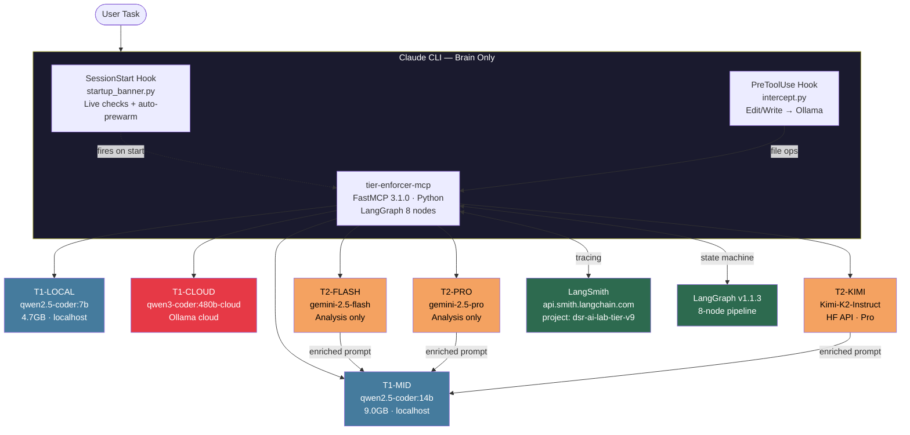
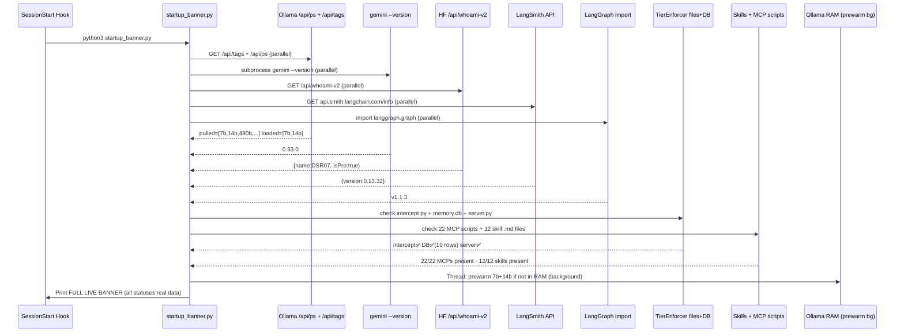
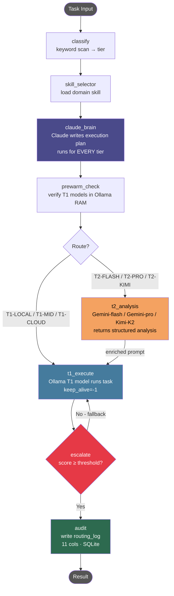
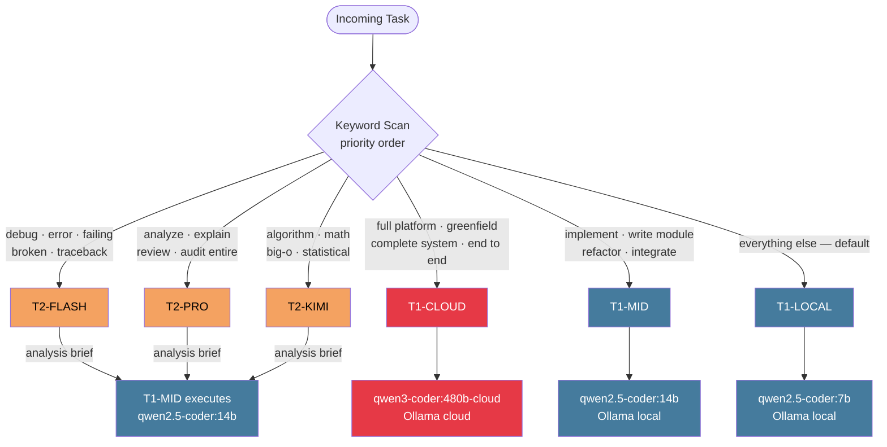
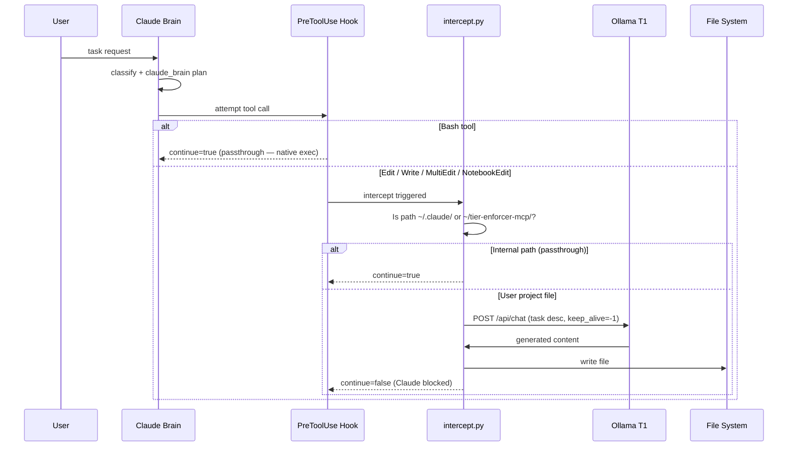
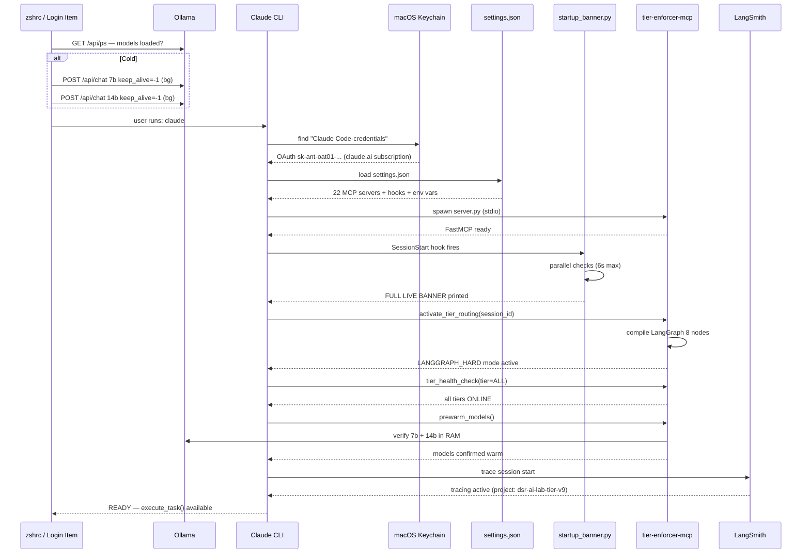
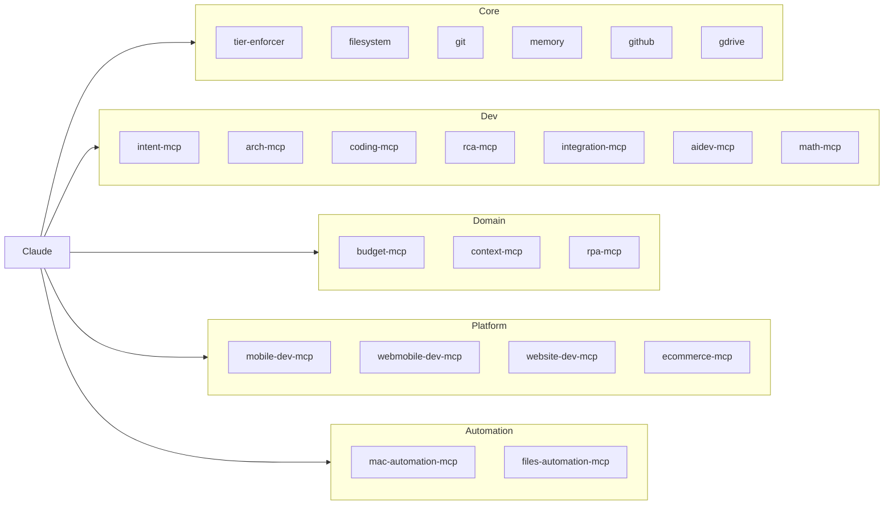

# DSR AI-Lab Tier Routing v9.1 — Architecture

**Version:** v9.1 | **Date:** 2026-03-22 | **Repo:** Claude-Tier-MacMini

---

## System Overview

DSR AI-Lab Tier Routing is a production AI orchestration system for Claude CLI on Mac Mini.
Claude acts as **Brain only** — classifies, plans, routes. Ollama T1 models execute all code
and file writes. T2 models (Gemini / Kimi) analyze and enrich prompts — they never execute.

Every Claude session fires `startup_banner.py` which live-checks all 6 models, LangSmith,
LangGraph, TierEnforcer DB, 22 MCP servers, and 12 Skills in parallel — auto-prewarming
T1-LOCAL and T1-MID in background.

---

## High-Level Architecture



---

## Startup Banner Flow



---

## LangGraph State Machine (8 Nodes)



| Node | Responsibility |
|------|---------------|
| `classify` | Keyword scan → assign tier (T1-LOCAL / T1-MID / T1-CLOUD / T2-FLASH / T2-PRO / T2-KIMI) |
| `skill_selector` | Load matching skill `.md` file into context from `~/.claude/skills/` |
| `claude_brain` | Claude writes step-by-step execution plan — runs for **every** tier |
| `prewarm_check` | Verify 7b + 14b are in Ollama RAM; load if cold |
| `t2_analysis` | Gemini-flash / Gemini-pro / Kimi-K2 analyzes task → returns structured brief |
| `t1_execute` | Ollama runs task with brain plan + optional T2 analysis (`keep_alive=-1`) |
| `escalate` | Score < threshold → bump to next tier (max 2 fallbacks) |
| `audit` | Write row to `routing_log` (11 cols: ts, session, task, classified_tier, executor_tier, model, score, ok, elapsed, skills, brain_used) |

---

## Task Classification Flow



---

## Intercept / Hook Flow



**Bash is always native.** Internal paths (`~/.claude/`, `~/tier-enforcer-mcp/`) passthrough.
All user project file writes go through Ollama — Claude physically cannot write them.

---

## Fallback / Escalation Chain

```mermaid
flowchart LR
    TL["T1-LOCAL<br/>qwen2.5-coder:7b<br/>threshold 0.45"]
    TM["T1-MID<br/>qwen2.5-coder:14b<br/>threshold 0.55"]
    TC["T1-CLOUD<br/>qwen3-coder:480b-cloud<br/>threshold 0.60"]
    TF["T2-FLASH<br/>gemini-2.5-flash<br/>threshold 0.50"]
    TP["T2-PRO<br/>gemini-2.5-pro<br/>threshold 0.50"]
    TK["T2-KIMI<br/>Kimi-K2-Instruct<br/>threshold 0.50"]
    END([best result])

    TL -->|score low| TM
    TM -->|score low| TC
    TC -->|score low| TF
    TF -->|score low| TP
    TP -->|score low| TK
    TK -->|max 2 fallbacks| END

    style TL fill:#457b9d,color:#fff
    style TM fill:#457b9d,color:#fff
    style TC fill:#e63946,color:#fff
    style TF fill:#f4a261,color:#000
    style TP fill:#f4a261,color:#000
    style TK fill:#f4a261,color:#000
```



---

## Full Session Startup Sequence



---

## Database Schema (`~/.tier-enforcer/memory.db`)

```sql
CREATE TABLE routing_log (
    ts              REAL,   -- Unix timestamp
    session         TEXT,   -- session UUID
    task            TEXT,   -- task text (first 120 chars)
    classified_tier TEXT,   -- tier classifier assigned (e.g. T2-FLASH)
    executor_tier   TEXT,   -- tier that actually executed (e.g. T1-MID)
    model           TEXT,   -- model name used
    score           REAL,   -- quality score 0.0–1.0
    ok              INTEGER,-- 1=success 0=failure
    elapsed         REAL,   -- total seconds
    skills          TEXT,   -- JSON array of matched skills
    brain_used      INTEGER -- 1=claude_brain ran
);
```

---

## MCP Servers (22 total)



---

## Skills (12 total, `~/.claude/skills/`)

| Skill | Domain |
|-------|--------|
| `aiapp` | AI app development |
| `arch` | Architecture / ADR |
| `math` | Mathematics / algorithms |
| `multifile` | Multi-file implementation |
| `rca` | Root cause analysis / debugging |
| `scope` | Task scoping |
| `tier-audit` | Tier routing audit |
| `tier-debug` | Tier system debugging |
| `tier-health` | Tier health checks |
| `tier-report` | Routing report generation |
| `tier-reset` | Tier state reset |
| `wire` | Wiring / integration |

---

## Component Files

| File | Type | Purpose |
|------|------|---------|
| `tier-enforcer-mcp/server.py` | Python | FastMCP 3.1.0 · LangGraph 8 nodes · SQLite audit |
| `tier-enforcer-mcp/intercept.py` | Python | PreToolUse hook — Edit/Write → Ollama |
| `tier-enforcer-mcp/startup_banner.py` | Python | **v9.1** — live status banner + auto-prewarm |
| `tier-enforcer-mcp/langgraph_tier.py` | Python | LangGraph state + node definitions |
| `dotfiles/CLAUDE.md` | Markdown | Brain protocol v9 — startup calls + tier rules |
| `dotfiles/settings.json` | JSON | Hooks + 22 MCP servers + env vars |
| `dotfiles/settings.local.json` | JSON | SessionStart hook → startup_banner.py |
| `src/core/router.ts` | TypeScript | tier-router-mcp routing engine (18 tools) |

---

## v9 → v9.1 Architecture Changes

| Aspect | v9 | v9.1 |
|--------|----|------|
| Startup check | Static echo banner (no real checks) | `startup_banner.py` — 9 parallel live checks |
| Model status granularity | Binary Ollama up/down | Per-model: LIVE / READY / NOT PULLED |
| LangSmith | Config only, not verified | Live API ping on every start |
| LangGraph | Assumed available | Import + version verified on every start |
| TierEnforcer health | Not shown at startup | intercept.py + DB row count + server.py |
| MCP server health | Not verified | All 22 script paths checked |
| Skills health | Not verified | All 12 `.md` files checked |
| HF API endpoint | `/api/whoami` (deprecated — always 401) | `/api/whoami-v2` (correct endpoint) |
| HF key loading | `os.environ` only (broken for hooks) | Reads `settings.json` mcpServers env directly |
| Prewarm trigger | Only from zshrc/Login Item | Also from `startup_banner.py` background thread |

---

*DSR AI-Lab — Mac Mini — Architecture v9.1 — 2026-03-22*
