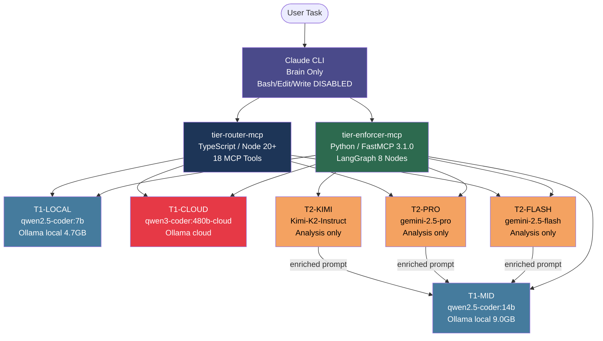
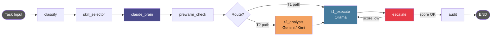
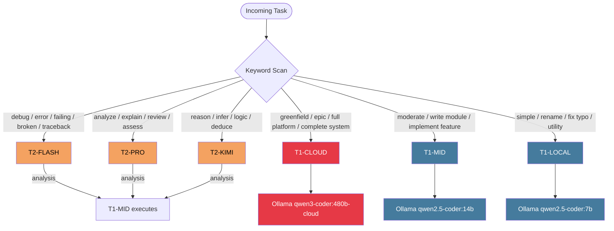
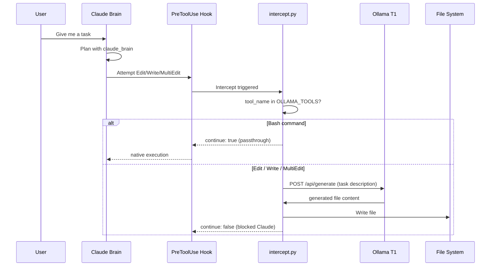
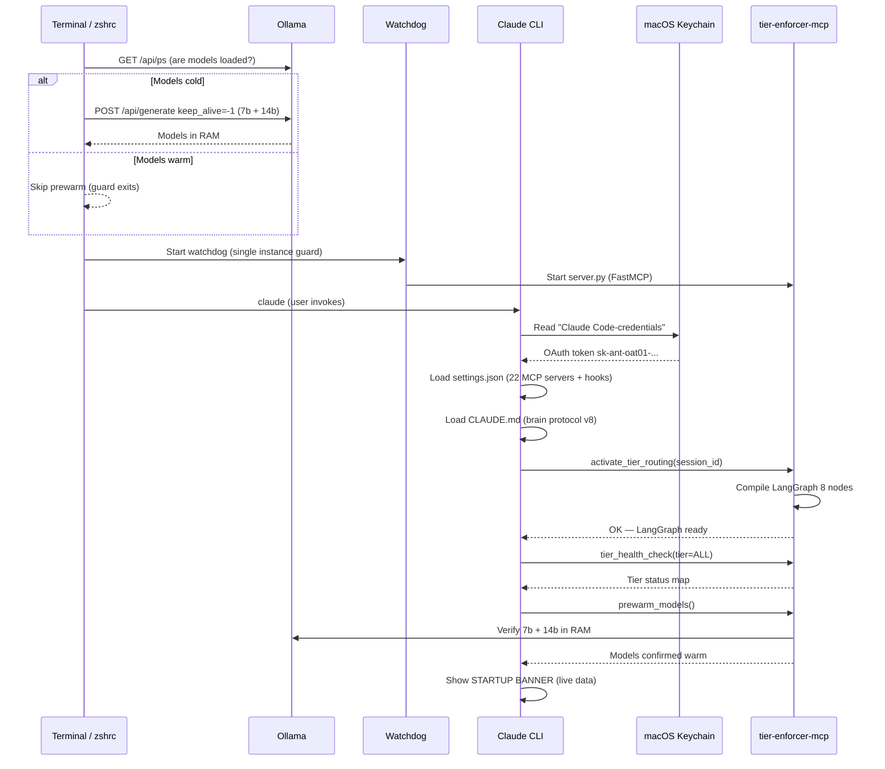

# DSR AI-Lab Tier Routing v9 — Architecture

**Version:** v9 | **Date:** 2026-03-22 | **Repo:** Claude-Tier-MacMini

---

## System Overview

DSR AI-Lab Tier Routing is a dual-MCP AI orchestration system. Claude acts as **Brain only** — it classifies, plans, and routes. Ollama T1 models execute all code, file writes, and bash commands. T2 models (Gemini/Kimi) provide analysis that enriches T1 prompts — they never execute directly.

---

## High-Level Architecture



---

## LangGraph State Machine (8 Nodes)



| Node | Responsibility |
|------|---------------|
| `classify` | Keyword scan → assign tier (T1-LOCAL / T1-MID / T1-CLOUD / T2-FLASH / T2-PRO / T2-KIMI) |
| `skill_selector` | Load domain skill file into context (e.g. retail-analytics, cybersecurity) |
| `claude_brain` | Claude writes execution plan — runs for EVERY tier |
| `prewarm_check` | Verify 7b + 14b models are loaded in Ollama RAM |
| `t2_analysis` | Gemini-flash / Gemini-pro / Kimi-K2 analyzes task, returns structured analysis |
| `t1_execute` | Ollama runs task using T1 model + claude_brain plan + optional T2 analysis |
| `escalate` | If quality score < threshold → bump to next tier (max 2 fallbacks) |
| `audit` | Write row to `routing_log` (11 cols: ts, session, task, classified_tier, executor_tier, model, score, ok, elapsed, skills, brain_used) |

---

## Task Classification Flow



---

## Intercept / Hook Flow (Edit/Write Protection)



**Bash is native passthrough.** Edit/Write/MultiEdit/NotebookEdit always go through Ollama — Claude physically cannot write files directly.

---

## Fallback / Escalation Chain

```mermaid
flowchart LR
    TL[T1-LOCAL<br/>threshold 0.45] -->|score low| TM
    TM[T1-MID<br/>threshold 0.55] -->|score low| TC
    TC[T1-CLOUD<br/>threshold 0.60] -->|score low| TF
    TF[T2-FLASH<br/>threshold 0.50] -->|score low| TP
    TP[T2-PRO<br/>threshold 0.50] -->|score low| TK
    TK[T2-KIMI<br/>threshold 0.50] -->|max fallbacks| END([Stop])

    style TL fill:#457b9d,color:#fff
    style TM fill:#457b9d,color:#fff
    style TC fill:#e63946,color:#fff
    style TF fill:#f4a261,color:#000
    style TP fill:#f4a261,color:#000
    style TK fill:#f4a261,color:#000
```



Max fallbacks per task: **2**. Quality scores written to `routing_log` for every attempt.

---

## Session Startup Sequence



---

## Database Schema (`routing_log`)

```sql
CREATE TABLE routing_log (
    ts              TEXT,       -- ISO timestamp
    session         TEXT,       -- session UUID
    task            TEXT,       -- task description (first 200 chars)
    classified_tier TEXT,       -- e.g. T2-FLASH
    executor_tier   TEXT,       -- actual executing tier (e.g. T1-MID)
    model           TEXT,       -- model name used
    score           REAL,       -- quality score 0.0-1.0
    ok              INTEGER,    -- 1=success, 0=failure
    elapsed         REAL,       -- seconds elapsed
    skills          TEXT,       -- JSON array of matched skills
    brain_used      INTEGER     -- 1=claude_brain ran, 0=skipped
);
```

---

## v9 vs v8 Diff

| Aspect | v8 | v9 |
|--------|----|----|
| Tiers | T1-LOCAL, T1-MID, T1-CLOUD, T2-FLASH, T2-PRO, T2-KIMI, **T3-EPIC** | T1-LOCAL, T1-MID, T1-CLOUD, T2-FLASH, T2-PRO, T2-KIMI |
| Epic routing | T3-EPIC → blueprint → T1-CLOUD | T1-CLOUD directly |
| LangGraph nodes | 9 (included t3_plan) | 8 (t3_plan removed) |
| claude_brain | Ran for every tier | Ran for every tier (same) |
| T3-EPIC rationale | "Claude writes blueprint" | Redundant — claude_brain already does this |
| MODEL_T1_CLOUD | `qwen3-coder:480b` | `qwen3-coder:480b-cloud` (fixed) |
| keep_alive | 7b + 14b only | 7b + 14b + 480b-cloud |
| DB columns | 8 | 11 (+ elapsed, skills, brain_used) |
| Auth | ANTHROPIC_API_KEY env var | OAuth macOS Keychain only |
| Prewarm | Fires every terminal open | Guarded: checks /api/ps first |

---

## Constraint Summary

| Rule | What it means |
|------|--------------|
| RULE 1 | Bash/Edit/Write/MultiEdit disabled for Claude — attempt = ignored |
| RULE 2 | Every task goes through `execute_task()` MCP tool |
| RULE 5 | Epic tasks → T1-CLOUD — T3-EPIC does not exist in v9 |
| RULE 6 | T2 = analysis only; T1 = all execution |
| RULE 7 | tier-enforcer offline → HARD STOP, Claude refuses all tasks |

---

*DSR AI-Lab — Mac Mini — Architecture v9 — 2026-03-22*
